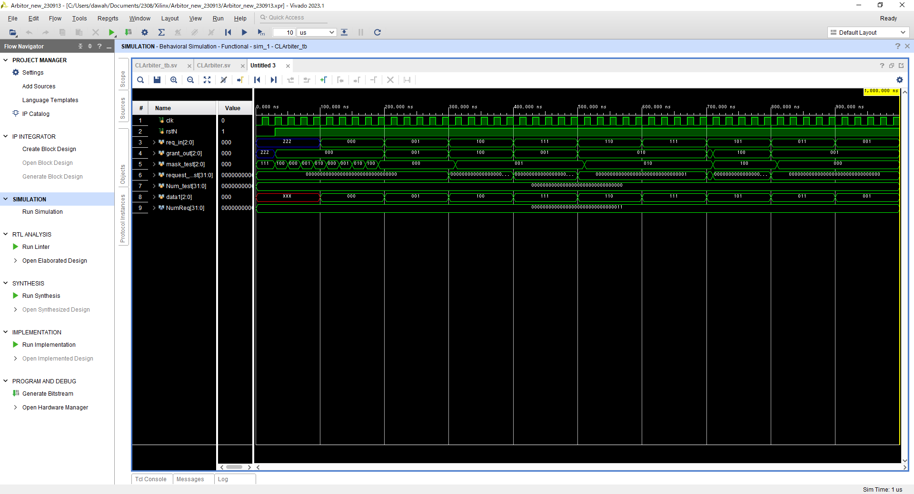
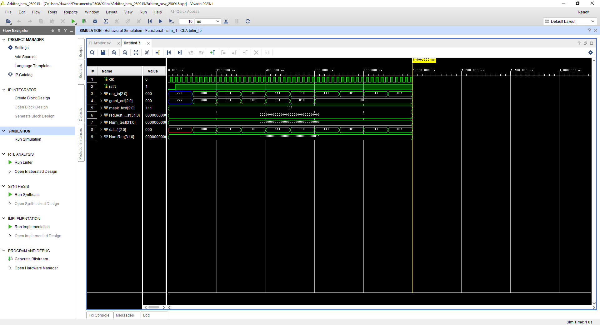

# verilog sourcecode

## 1
説明：ラウンドロビンアービタ 
内部クロックの立ち上がりに同期してリクエストの占有権が入れ替わります　 
実装は、[Round-Robin Arbiter Design in Verilog and SystemVerilog](https://circuitcove.com/design-examples-rr-arbiter/)を参考にしました  
マスクという方法を利用しています  
優先順位を強制的に変更する役割を果たしています  
[RRArbiter](./RRArbiter_230914/RRArbiter.sv)  
[Arbiter](./RRArbiter_230914/Arbiter.sv)  
[Test Bench](./RRArbiter_230914/RRArbiter_TB.sv)   

## 2 :new
説明：ラウンドロビンアービタ（利用中保持） 
1のアービタを改善し、リクエストが利用中のときにグラントを入れ替わらないようにしました  
内部クロックの立ち上がりに同期して、グラントが変更されれば更新されます  
現在動作にバグがあり、苦戦中です（下図）  
マスクが前半部分で毎クロック変更されています 
[Arbiter](./CLArbiter_230914/CLArbiter.sv)   
[test bench](./CLArbiter_230914/CLArbiter_tb.sv)   
   
図1：シミュレーション　バグあり 23/09/14
   
図1：シミュレーション　優先度切り替えなし 23/09/15
   
図1：シミュレーション　修正したがバグ 23/09/15