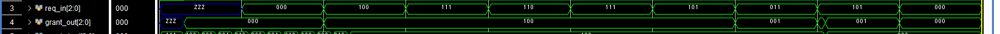
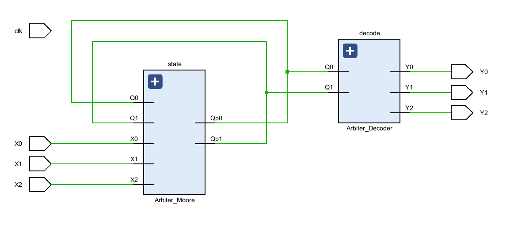
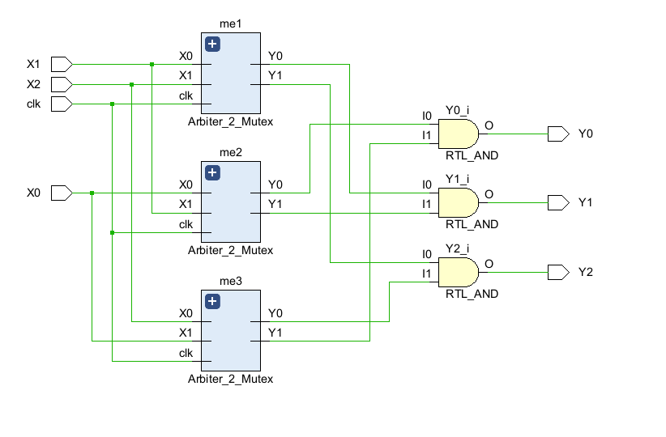
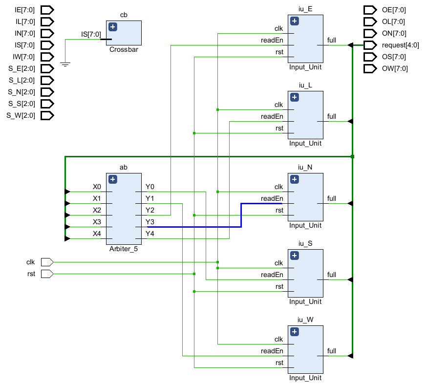
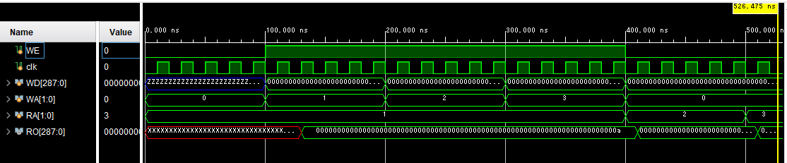

# verilog sourcecode

## 1
説明：ラウンドロビンアービタ 
内部クロックの立ち上がりに同期してリクエストの占有権が入れ替わります　 
実装は、[Round-Robin Arbiter Design in Verilog and SystemVerilog](https://circuitcove.com/design-examples-rr-arbiter/)を参考にしました  
マスクという方法を利用しています  
優先順位を強制的に変更する役割を果たしています    
[RRArbiter](./RRArbiter_230914/Arbiter.sv)  

## 2 
説明：ラウンドロビンアービタ（利用中保持） 
1のアービタを改善し、リクエストが利用中のときにグラントを入れ替わらないようにしました  
内部クロックの立ち上がりに同期して、グラントが変更されれば更新されます  
ほぼ完全に動作することに成功しました（下図、23/09/15）   

[CLArbiter](./CLArbiter_230914/CLArbiter.sv)  
   
シミュレーション　ほぼ成功 23/09/15
   
アップで 23/09/15

## 3 
説明：論理回路で組みなおしたアービタ  
   
### [Arbiter3](./Arbiter3_230923/Arbiter_3.v)  

## 4
説明：4入力アービタ  
### [Arbiter4](./Arbiter4_230925/Arbiter_4_Moore.v)  

## 5
説明：2入力Mutexを使った3入力アービタ  

### [Arbiter3me](./Arbiter3_Mutex_230926/Arbiter_3.v)  

## 5
説明：2入力Mutexを使った4入力アービタ  
### [Arbiter4me](./Arbiter4_Mutex_230926/Arbiter_4.v)  

## 6
説明：2入力Mutexを使った5入力アービタ  
やっとルータが作れる！！  
### [Arbiter5me](./Arbiter5_Mutex_230929/Arbiter_5.v)  

## 7
説明：Mutex5を使ったNoCルータ  
 
### [NoC](./Router_231001/Router.v)  

## 8
説明：3バッファFIFO  

### [FIFO](./FIFO_231026/FIFO.v)  